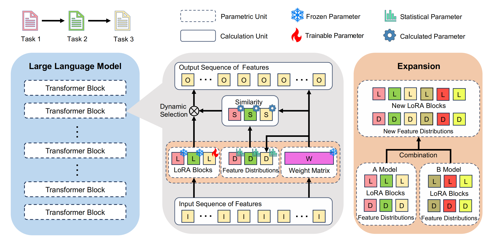

# Online-CL-LLMs

> This repository contains the official implementation for our ICML 2025 paper: *Exploiting Presentative Feature Distributions for Parameter-Efficient Continual Learning of Large Language Models*.



## Training

Generate the training script by executing:

```sh
python gen_script_new_{benchmark}_{model}.py
```

Then run the resulting script to start the training.

## Evaluation

Compute key metrics including: Average Performance (AP), Forgetting Rate (F.Ra), Forward Transfer (FWT) and Backward Transfer (BWT). Execute the following command:

```sh
python score.py your_result_path single_result_path 
```

<!--
## Citation
If you find our work useful for your research, please kindly cite our paper as follows:
```
@inproceedings{,
  title={Exploiting Presentative Feature Distributions for Parameter-Efficient Continual Learning of Large Language Models},
  author={Xin Cheng, Jiabo Ye, Haiyang Xu, Ming Yan, Ji Zhang, Feng Liu, Fei Huang, Lei Feng},
  booktitle={Proceedings of the 42th International Conference on Machine Learning (ICML'25)},
  year={2025}
}
```
-->

## Credits
The code of this repository partly relies on [SAPT](https://github.com/circle-hit/SAPT.git) and we would like to show our sincere gratitude to authors of it.
